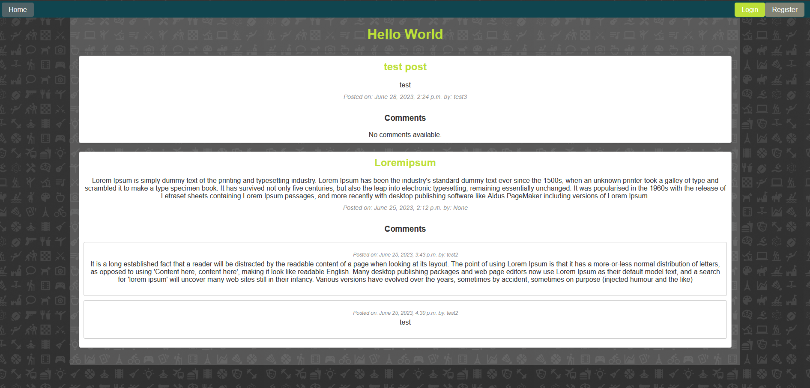
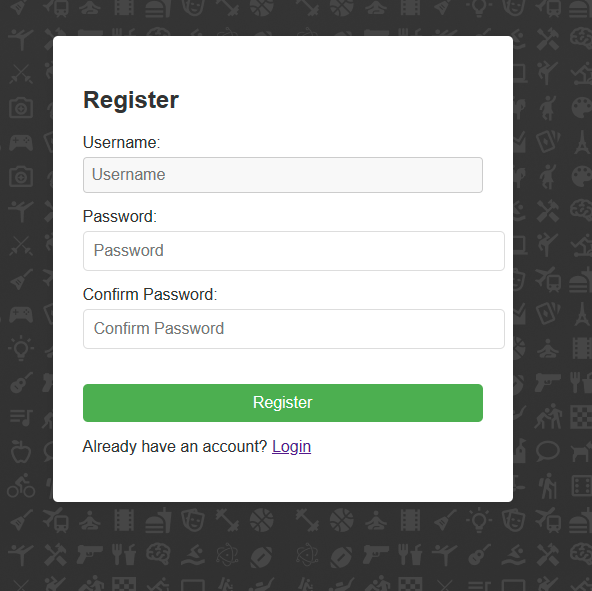
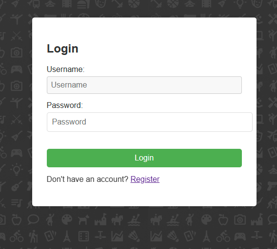
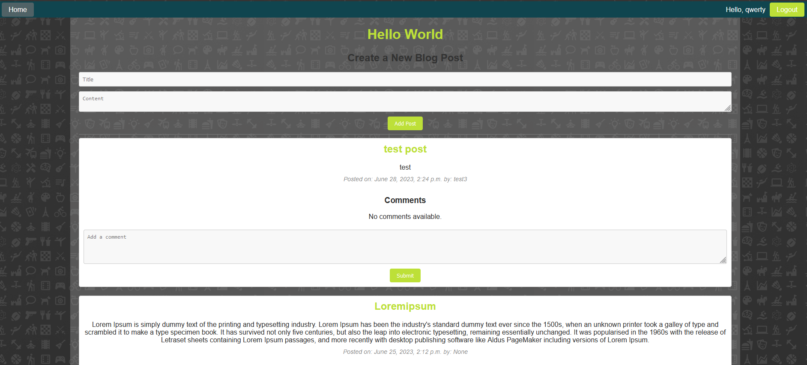
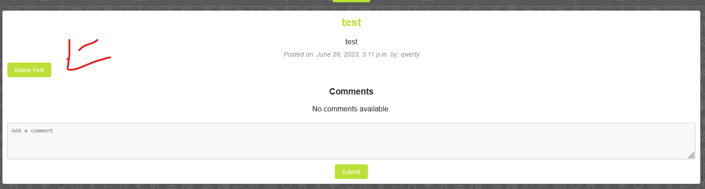
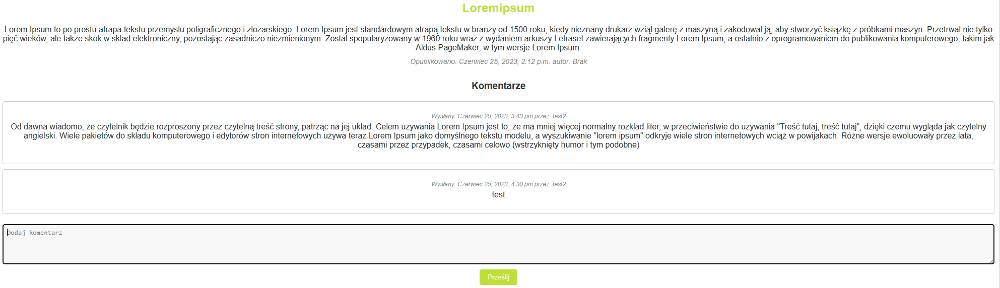
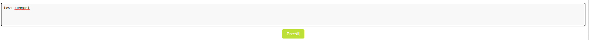
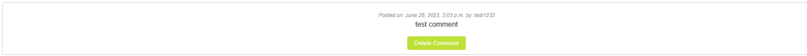

Dokumentacja dla My Blog
Opis

My Blog to strona blogowa, która umożliwia użytkownikom tworzenie postów blogowych i komentarzy. Strona umożliwia tworzenie konta użytkownika, logowanie i wylogowanie.
Funkcjonalność
Strona główna

Na stronie głównej prezentowane są wszystkie posty blogowe, sortowane od najnowszego do najstarszego. Każdy post zawiera tytuł, treść, datę publikacji oraz autora. Użytkownicy zalogowani mogą tworzyć nowe posty blogowe bezpośrednio ze strony głównej.

Rejestracja

Strona oferuje funkcjonalność rejestracji nowego użytkownika. Wymagane jest podanie nazwy użytkownika, adresu e-mail oraz hasła.

Logowanie i wylogowanie

Użytkownicy mogą się zalogować do swojego konta, podając nazwę użytkownika i hasło. Po zalogowaniu są przekierowywani do strony głównej. Użytkownicy mogą również się wylogować, co również przekierowuje ich do strony głównej.

Tworzenie posta

Zalogowani użytkownicy mogą tworzyć nowe posty blogowe. Formularz tworzenia postu zawiera pola na tytuł i treść postu. Po utworzeniu postu, użytkownik jest przekierowany do strony głównej.

Usuwanie posta

Autor posta ma możliwość usunięcia swojego postu. Po usunięciu postu, użytkownik jest przekierowany do strony głównej.

Dodawanie komentarza

Zalogowani użytkownicy mogą dodawać komentarze do postów. Formularz dodawania komentarza zawiera pole na treść komentarza. Po dodaniu komentarza, użytkownik jest przekierowany do strony głównej.

Usuwanie komentarza

Autor komentarza ma możliwość usunięcia swojego komentarza. Po usunięciu komentarza, użytkownik jest przekierowany do strony głównej.

